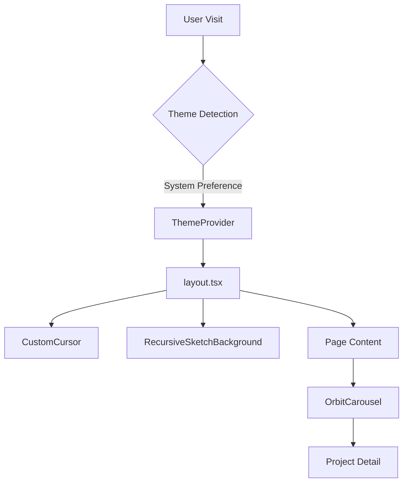

# ✧ Yash Dogra | Recursive Developer ✧

[](https://nextjs.org/)
[](https://www.typescriptlang.org/)
[](https://tailwindcss.com/)
[](https://www.framer.com/motion/)

> [!IMPORTANT]
> A premium, interactive portfolio engineered for performance and visual impact. Specializing in NLP, computer vision, and creative frontend architecture.

---

## ✦ The Vision
As a **Recursive Developer & ML Engineer**, I build interfaces that aren't just seen—they are experienced. This repository houses my latest professional showcase, featuring complex 3D transforms, reactive generative art, and a server-side optimized architecture.

---

## 🛠 Tech Stack & Architecture

### Core Engineering
| Component | Technology | Role |
| :--- | :--- | :--- |
| **Framework** | Next.js 16 (App Router) | Structural foundation and SSR routing |
| **Logic** | TypeScript | Strict type-safety and architectural integrity |
| **Styling** | Tailwind CSS v4 | Utility-first, performance-first aesthetics |
| **Motion** | Framer Motion | Smooth state transitions and micro-interactions |
| **Generative** | p5.js | Dynamic, math-based background animations |

### System Flow


---

## ✨ Featured Exhibits

### 🎠 [OrbitCarousel](file:///Users/venom/test%20site/src/components/OrbitCarousel.tsx)
A high-performance 3D carousel utilizing CSS `transform-style: preserve-3d`. It supports multi-axis rotation, touch interaction, and smooth scroll hijacking with Framer Motion.

### 🎨 [RecursiveGraphBackground](file:///Users/venom/test%20site/src/components/RecursiveSketchBackground.tsx)
A p5.js-driven generative background that evolves based on user site activity. Engineered to run off the main thread where possible and optimized for 60fps across dark/light modes.

---

## 🚀 Getting Started

### Prerequisites
- Node.js 20+
- npm 10+

### Development
```bash
# Clone and install
git clone https://github.com/yxshee/test-site.git
cd test-site
npm install

# Launch dev server
npm run dev
```

---

## 📏 Engineering Standards

This project adheres to strict **Senior Principal Engineer** standards:
- **Clean Code**: SOLID principles and DRY logic across all components.
- **Strict Naming**: Follows the [Naming Standard](file:///Users/venom/test%20site/docs/naming-standard.md).
- **Security**: Zero-trust input handling and sanitized UI rendering.
- **Accessibility**: WCAG 2.1 compliant with full reduced-motion support.

---

<div align="center">
  <sub>Built with precision by Yash Dogra • 2026</sub>
</div>
